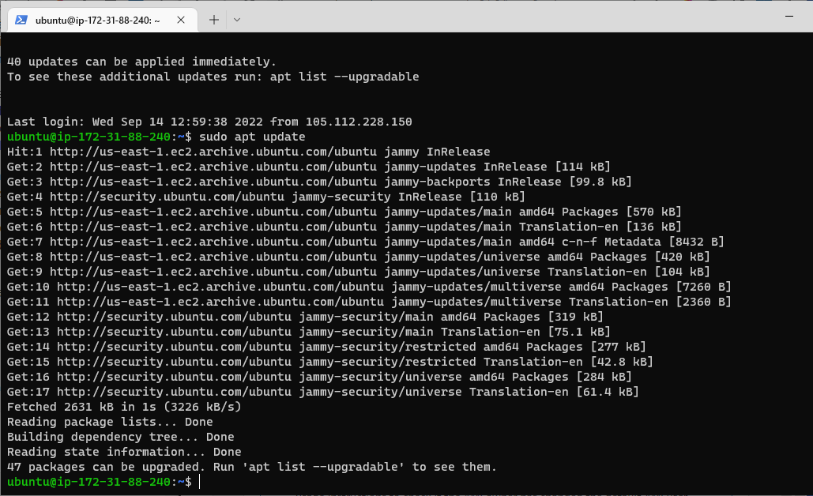

# PROJECT 1 
## THE IMPLEMENTATION OF LAMP STACK

### Step 1 : Installing apache and updating the fire wall

- update a list of packages in package manager 

`sudo apt update`

- run apache2 package installation

`sudo apt install apache2`

To verify that apache2 is running as a Service in our OS, use  command:

`sudo systemctl status apache2`

As we know, we have TCP port 22 open by default on our EC2 machine to access it via SSH, so we need to add a rule to EC2 configuration to open inbound connection through port 80:

we can access our running server locally and from the Internet (Source 0.0.0.0/0 means ‘from any IP address’).

 Now we check if we can access the server locally in our Ubuntu shell by, using ‘curl’ command to request our Apache HTTP Server on port 80.
 
 run command:
 
  `curl http://localhost:80`

  

  As we can see Apache web service responded to ‘curl’ command with some payload.

We test if our Apache HTTP server can respond to requests from the Internet by Open a web browser of our choice and try to access it with the following url

`http://<44.205.250.41>:80`

On seeing the following page, confirms the web server is now correctly installed and accessible through the firewall.

### STEP 2 — INSTALLING MYSQL

We need a relational  Database Management System (DBMS) to be able to store and manage data for the site and  MySQL is a popular relational database management system used within PHP environments, so we will use it.

To install it we will use the 'sudo apt' command

`$ sudo apt install mysql-server`

 After the installation was done, logged into the MySQL console by typing:

 `$ sudo mysql`

 

It’s recommended that you run a security script that comes pre-installed with MySQL. This script will remove some insecure default settings and lock down access to your database system. Before running the script you will set a password for the root user, using mysql_native_password as default authentication method. We’re defining this user’s password as PassWord.1.

`ALTER USER 'root'@'localhost' IDENTIFIED WITH mysql_native_password BY 'PassWord.1';`

Exit the MySQL shell with:

`mysql> exit`

Start the interactive script,this will ask if you want to configure the VALIDATE PASSWORD PLUGIN.

Note: Enabling this feature is something of a judgment call.

run: `$ sudo mysql_secure_installation ` 

Answer Y for yes, or anything else to continue without enabling

After we finish, we test our ability to log in to the MySQL console by typing:

 `$ sudo mysql -p`

An 'Enter Password' prompt comes up, enter root user password for access

 To exit the MySQL console, type:
 
  `mysql> exit`

 

 ### STEP 3 — INSTALLING PHP

 PHP is the component of our setup that will process code to display dynamic content to the end user. 

In addition to the php package, you’ll need php-mysql, a PHP module that allows PHP to communicate with MySQL-based databases. You’ll also need libapache2-mod-php to enable Apache to handle PHP files.

To install these 3 packages at once, run:

`sudo apt install php libapache2-mod-php php-mysql`

type 'y' to continue

 Run the following command to confirm  PHP version:

 `php -v`

At this point, your LAMP stack is completely installed and fully operational.

### STEP 4 — CREATE A VIRTUAL HOST FOR YOUR WEBSITE USING APACHE

In this project, we will set up a domain called projectlamp.

Create the directory for projectlamp using ‘mkdir’ command as follows:

`sudo mkdir /var/www/projectlamp`

Next, assign ownership of the directory with your current system user:

`sudo chown -R $USER:$USER /var/www/projectlamp`

Then, create and open a new configuration file in Apache’s sites-available directory using your preferred command-line editor. Here, we’ll be using vi or vim (They are the same by the way):

`sudo vi /etc/apache2/sites-available/projectlamp.conf`

This will create a new blank file. Paste in the following bare-bones configuration by hitting on i on the keyboard to enter the insert mode,

 and paste the text:

 `<VirtualHost *:80>
    ServerName projectlamp
    ServerAlias www.projectlamp 
    ServerAdmin webmaster@localhost
    DocumentRoot /var/www/projectlamp
    ErrorLog ${APACHE_LOG_DIR}/error.log
    CustomLog ${APACHE_LOG_DIR}/access.log combined
</VirtualHost>
`

To save and close the file, simply follow the steps below:

- Hit the esc button on the keyboard

- Type :Type wq (w for write and q for quit)

- Hit ENTER to save the file

use the ls command: (to show the new file in the sites-available directory)

`sudo ls /etc/apache2/sites-available`

With this VirtualHost configuration, we’re telling Apache to serve projectlamp using /var/www/projectlampl as its web root directory.

We can now use a2ensite command to enable the new virtual host:

`sudo a2ensite projectlamp`

Disable the default website that comes installed with Apache, so it's default configuration would'nt overwrite the virtual host. To disable Apache’s default website use a2dissite command , type:

`sudo a2dissite 000-default`

To make sure your configuration file doesn’t contain syntax errors, run:

`sudo apache2ctl configtest`

Finally, reload Apache so these changes take effect:

`sudo systemctl reload apache2`

The new website is now active, but the web root /var/www/projectlamp is still empty. Create an index.html file in that location so that we can test that the virtual host works as expected:

`sudo echo 'Hello LAMP from hostname' $(curl -s http://169.254.169.254/latest/meta-data/public-hostname) 'with public IP' $(curl -s http://169.254.169.254/latest/meta-data/public-ipv4) > /var/www/projectlamp/index.html
`

Now go to your browser and try to open your website URL using IP address:

http://54.166.73.55:80

Seeing the text from ‘echo’ command written to index.html file, means the Apache virtual host is working as expected.

### STEP 5 — ENABLE PHP ON THE WEBSITE

With the default DirectoryIndex settings on Apache, a file named index.html will always take precedence over an index.php file.

To change this behavior, you’ll need to edit the /etc/apache2/mods-enabled/dir.conf file and change the order in which the index.php file is listed within the DirectoryIndex directive:

`sudo vim /etc/apache2/mods-enabled/dir.conf`

Delete vim content with these steps

- hit esc key
- type : 
- type %d

- hit enter key

hit 'i' key to insert:

`<IfModule mod_dir.c>
        #Change this:
        #DirectoryIndex index.html index.cgi index.pl index.php index.xhtml index.htm
        #To this:
        DirectoryIndex index.php index.html index.cgi index.pl index.xhtml index.htm
</IfModule>
`

to change vim content

After saving, close the file:

hit Enter to save

 you will need to reload Apache so the changes take effect:

`sudo systemctl reload apache2`

Finally, we will create a PHP script to test that PHP is correctly installed and configured on your server.

Create a new file named index.php inside your custom web root folder:

`vim /var/www/projectlamp/index.php`

 Add the following text, which is valid PHP code, inside the file:

 `<?php
phpinfo();
`

save and close the file, refresh the page and this is displayed:

since we can see this page on the browser, this means the PHP installation is working as expected.

it’s best to remove this file we created as it contains sensitive information about our PHP environment and Ubuntu server. You can use 'rm' to do so:

`sudo rm /var/www/projectlamp/index.php`

We are back to this display:

With this we have come to the end of this project which is the implementation of LAMP stack on an EC2 instance on AWS cloud.

Thank you.

